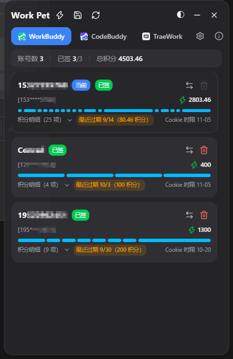
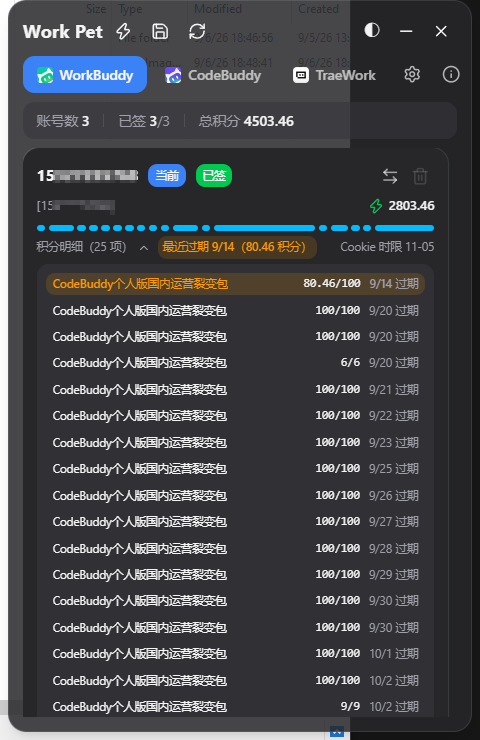
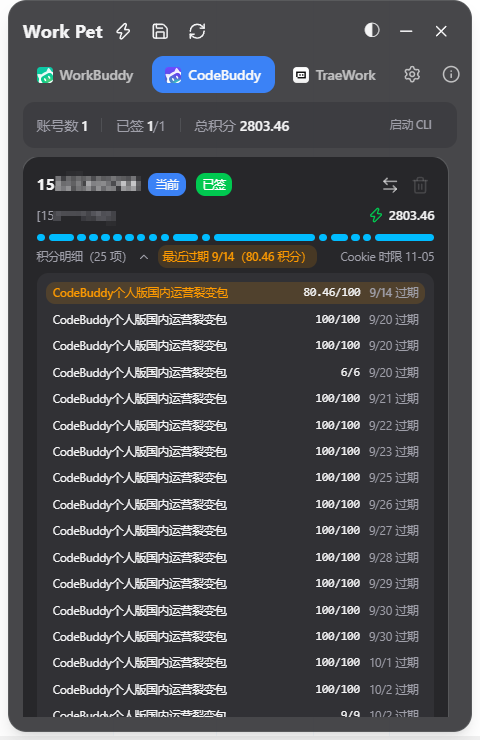
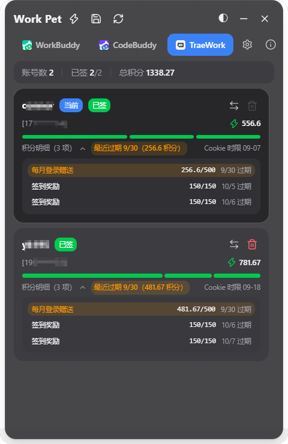
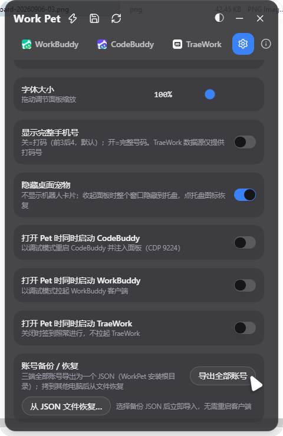
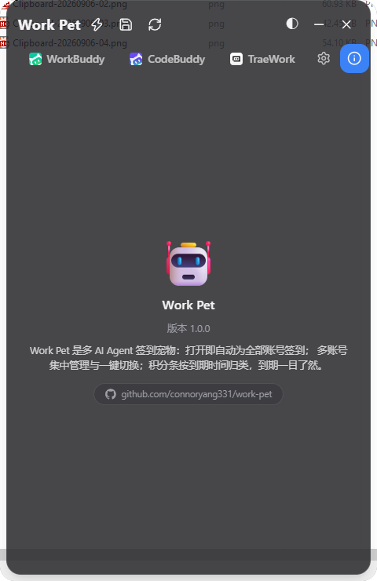
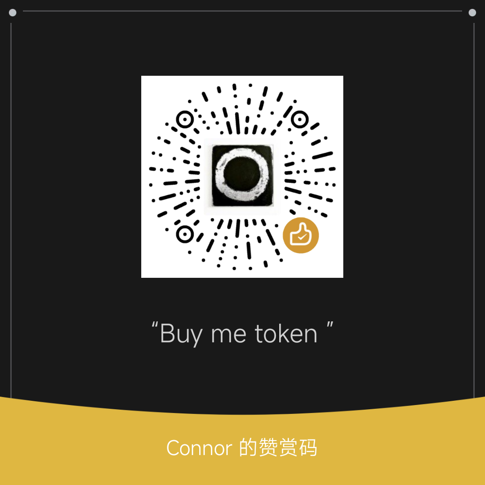

# Work Pet 🤖

**语言：** 简体中文

> **Work Pet 是多 AI Agent 签到宠物：打开即自动为全部账号签到；多账号集中管理与一键切换；积分条按到期时间归类，到期一目了然。账号与配置全部留在本机。**
> 本机回环 CDP 注入 · 不改官方安装包 · 安装后无需 Node.js / Python 环境

一个基于 **Chrome DevTools Protocol (CDP)** 的多 AI 编程客户端增强工具。
零侵入、零重签名——后台服务无头运行，经 CDP 与各客户端交互，完成签到与账号管理。


---

## 演示

<table>
  <tr>
    <td align="center"><strong>账号列表与积分条</strong>（WorkBuddy）<br></td>
    <td align="center"><strong>积分明细展开</strong><br></td>
    <td align="center"><strong>CodeBuddy</strong><br></td>
  </tr>
  <tr>
    <td align="center"><strong>TraeWork</strong>（绿色积分条）<br></td>
    <td align="center"><strong>设置</strong><br></td>
    <td align="center"><strong>关于</strong><br></td>
  </tr>
</table>

---

## 它能做什么

- **自动签到**：打开 Work Pet 即对全部账号静默签到（每日缓存幂等），客户端本体无需运行。
- **多账号管理**：每个客户端的账号集中展示，一键切换（自动以调试模式重启客户端并登录新账号）。
- **积分条**：按到期时间归类、段长与积分数量成正比，悬停查看到期日期与剩余天数；最近一次到期醒目高亮。
- **设备签到感知**：对按"设备"限额的签到自动轮换账号、按天公平分配，并在面板上一致呈现。
- **单文件备份/恢复**：三端全部账号导出为一个 `WorkPet-accounts-<时间戳>.json`，拷到其他电脑一键恢复。
- **桌面宠物**：3D 机器人形象（眨眼/天线呼吸/浮动动画），可缩到最小或隐藏到托盘，右键快捷菜单。
- **深色/浅色主题**、字号大小调节、标签顺序自定义（拖拽并记住）。

## 明确不做

本程序**只专注多 AI Agent 平台的签到**（含账号备份、切换与积分展示），其余一概不做，包括但不限于：

- ❌ 主题、壁纸、毛玻璃等外观定制
- ❌ 会话迁移、异常续接、暂存/快捷提示词
- ❌ 模型管理、记忆、免打扰、防休眠
- ❌ 客户端内的注入式增强面板

这些是同类项目（如 WorkDaddy）的能力，本程序不会实现。**请勿提交此类功能需求。**

## 面板

| 区域 | 能做什么 |
| ---- | -------- |
| **WorkBuddy / CodeBuddy / TraeWork** | 各端账号数、已签计数、总积分；账号卡片含积分条、最近过期、Cookie 时限；切换 / 删除 / 启动客户端 |
| **设置** | 随系统启动、字体大小、显示完整手机号、隐藏桌面机器人、启动客户端开关、账号备份 / 恢复 |
| **关于** | 版本与项目说明 |

---

## 安装

1. 在 [Releases](../../releases)（或 Actions 构建产物）下载 `WorkPet_0.1.0_x64-setup.exe`
2. 双击安装器完成安装
3. 打开 `Work Pet`：首次使用请先在各 AI 客户端登录一次账号，Work Pet 会自动备份进账号库

> 无需安装 Node.js / Python——运行时已随安装包捆绑。

---

## 工作原理

Work Pet 由两部分组成，**不修改、不注入、不重签任何客户端程序**：

- **桌面面板**（Tauri 应用）：你看到的机器人窗口，负责人机交互；
- **后台服务**（`daemon.js`，随面板自动启动的无头进程）：承担全部实际工作。

后台服务对每个 AI 客户端只做三件事：

1. **发现登录态**：各 AI 客户端本来就把登录凭证写在**自己本机的数据目录**里。Work Pet 读取这些文件（只读），把登录过的账号备份进单文件账号库 `WorkPet-accounts.json`。
2. **以账号本人身份直连官方接口**：用账号自己的 accessToken，以普通 HTTP 请求调用该平台的**签到**与**积分查询**接口——这一步完全不需要客户端运行，和你在网页版手动点签到没有区别。
3. **按需与客户端交互**：切换账号时把对应登录态写回客户端数据目录；客户端以调试模式运行时，还可以通过 CDP 让它刷新页面即时生效。

面板与后台服务之间通过 `127.0.0.1:47921` 的本地 API 通信（带随机生成的本地 token 鉴权，浏览器网页无法跨域调用）。

---

## 安全提示

担心账号安全？不用信任何人的一面之词——**把下面这段 prompt 连同本程序的源码仓库发给任意一个 AI**（智谱清言 / ChatGPT / Claude 都可以），让它替你审查。为节省 token，prompt 里已要求它无风险时只用一句话概括、有风险时再询问你是否展开详报：

```text
请帮我审查这个开源项目：https://github.com/connoryang331/work-pet
逐文件检查源码后回答一个问题：它是否会把我 AI 客户端的账号、token
或密码上传到作者自己的服务器？
- 如果没有风险，只用几个字概括即可，例如「安全，没有账号上传风险」。
- 如果存在风险，先询问我是否需要详细的风险报告，再展开说明。
```

本程序没有自己的服务器：全部网络请求只有两类——各 AI 平台的**官方接口**（签到 / 积分查询）和 GitHub。不放心的用户也可以用抓包工具（如 Fiddler、mitmproxy）自行验证。

---

## 账号迁移到其他电脑

1. 在 Work Pet 设置页点击「导出全部账号」，生成 `WorkPet-accounts-<时间戳>.json`（安装根目录）。
2. 用安全方式把文件传到新电脑，安装并启动 Work Pet。
3. 设置 → 「从 JSON 文件恢复…」选择该文件，账号立即导入。

> ⚠️ 导出文件包含可恢复登录状态的 token，**请像保护密码一样安全保存和传输**，
> 迁移完成后及时删除不再需要的副本。

---

## 安全与隐私

- **本地数据优先**：账号备份、配置不会在后台上传；签到与积分功能会访问各 AI 客户端的官方 API。
- 本地 API 带 token 鉴权，浏览器网页无法跨域调用。

---

## 🙏 致谢

- [智谱 Z.ai](https://z.ai/) —— 本程序的**全部代码**由 [ZCode](https://zcode.z.ai/)（GLM-5.3 官方 Harness）在
  **3 亿 Token 周末免费构建活动**期间完成：从架构设计、CDP 注入引擎、三端签到逻辑到桌面宠物 UI。
- [WorkDaddy](https://github.com/babygoton/WorkDaddy) —— WorkBuddy/CodeBuddy 端签到与积分解析逻辑的移植来源（AGPL-3.0）。

---

## 许可与声明

本项目采用 **[GNU Affero General Public License v3.0](LICENSE)** 开源（`SPDX-License-Identifier: AGPL-3.0-or-later`）。

- WorkBuddy / CodeBuddy 端的签到、积分解析与注入架构移植自 [WorkDaddy](https://github.com/babygoton/WorkDaddy)（AGPL-3.0），因此本项目同样以 AGPL-3.0 发布：任何修改（包括仅作为网络服务运行）都必须开源。
- 本项目仅面向本机运行的 AI 桌面客户端做体验增强，**与各客户端官方无隶属关系**；相关名称与商标归其权利人所有，本项目未获得官方授权或认可。

---

## 🧧 打赏支持

如果 Work Pet 对你有帮助，欢迎 Buy me token（为作者充点 token）：

<p align="center"></p>
